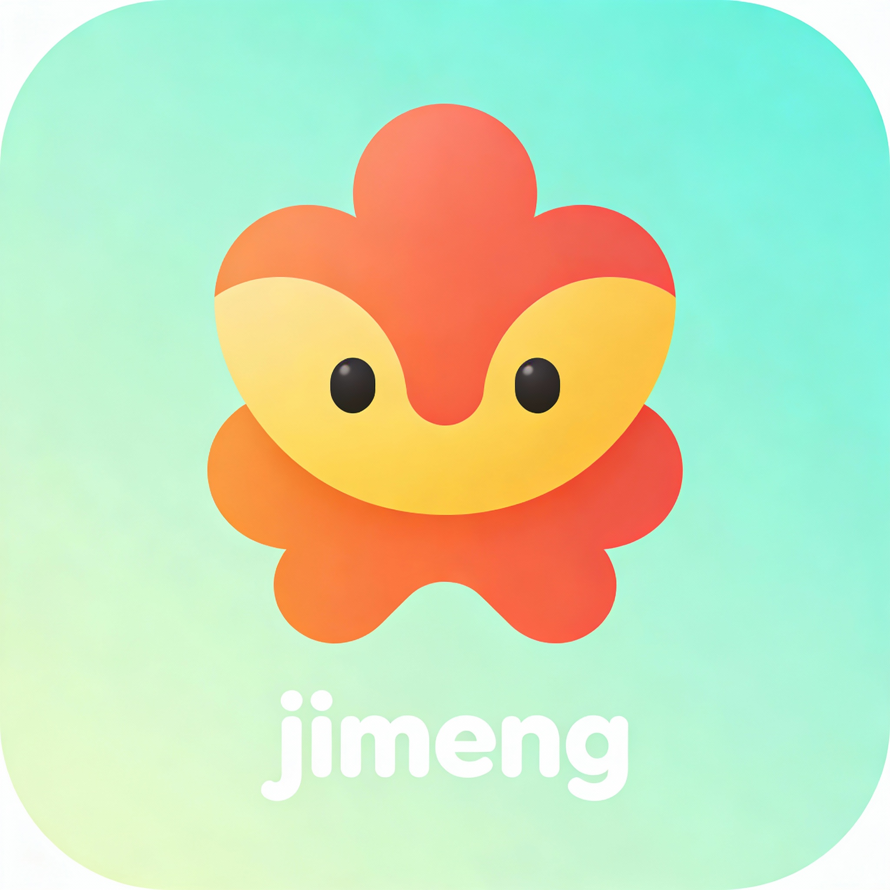

<div align="center">


*Dream your PPT like dreaming code.*

<p>

[](https://github.com/xiaohuihui202504/jimeng-slides/stargazers)
[](https://github.com/xiaohuihui202504/jimeng-slides/network)
[](https://github.com/xiaohuihui202504/jimeng-slides/watchers)

[](https://github.com/xiaohuihui202504/jimeng-slides)

[](https://github.com/xiaohuihui202504/jimeng-slides/blob/main/LICENSE)


</p> 

<b>一个基于DeepSeek-V3.2和即梦4.5的原生AI PPT生成应用，支持想法/大纲/页面描述生成完整PPT演示文稿、文本图片链接自动提取、上传任意素材、口头提出修改，迈向真正的"Vibe PPT"</b>

<b>🎯 降低PPT制作门槛，让每个人都能快速创作出美观专业的演示文稿</b>

<br>

## 🚀 项目体验地址

[**https://jimeng-slides.duckcloud.fun/**](https://jimeng-slides.duckcloud.fun/) | [**http://115.190.165.156:3002/**](http://115.190.165.156:3002/)

<br>

*如果该项目对你有用, 欢迎star🌟 &  fork🍴*

<br>

</p>

</div>


## ✨ 项目缘起

在这个信息爆炸的时代，我们每天都在与时间赛跑。灵感闪现的瞬间，我们渴望用最直接的方式将它呈现给世界，却常常被繁琐的制作过程所束缚。

传统的演示文稿制作就像一场漫长的修行——从构思到呈现，需要跨越模板选择的迷茫、内容组织的困境、视觉设计的瓶颈，以及无数次调整的折磨。现有的AI工具虽然带来了效率的提升，却依然存在着难以逾越的鸿沟：

- 🎭 **千篇一律的模板牢笼**——创意被预设的框架所限制
- 🔄 **迭代修改的噩梦**——每一次调整都意味着重新开始
- 🖼️ **图文脱节的尴尬**——文字与图像无法真正融合
- 🎨 **审美疲劳的困扰**——生成的作品缺乏灵魂和个性
- ⚡ **灵感流逝的焦虑**——从想法到成品的距离太过遥远

直到**DeepSeek-V3.2**与**即梦4.5**的相遇，一切都改变了。这不仅仅是技术的进步，更是创作方式的革新。DeepSeek-V3.2如同一位理解你思想的知音，能将模糊的想法转化为清晰的脉络；即梦4.5则像一位技艺精湛的视觉艺术家，将文字转化为富有生命力的图像。

它们的结合，让PPT创作从"制作"升华为"创作"，从"任务"转变为"表达"。每一个页面都能准确传达你的思想，每一张图片都能触动观众的心灵。这就是jimeng-slides的使命——让思想自由流淌，让创意即刻呈现。

## 👨‍💻 适用场景

1. **小白**：零门槛快速生成美观PPT，无需设计经验，减少模板选择烦恼
2. **PPT专业人士**：参考AI生成的布局和图文元素组合，快速获取设计灵感
3. **教育工作者**：将教学内容快速转换为配图教案PPT，提升课堂效果
4. **学生**：快速完成作业Pre，把精力专注于内容而非排版美化
5. **职场人士**：商业提案、产品介绍快速可视化，多场景快速适配


## 🎨 结果案例


<div align="center">

| | |
|:---:|:---:|
|  |  |
| **钱的演变：从贝壳到纸币的旅程** | **AI技术发展历程** |
|  |  |
| **人类对生态环境的影响** | **预制菜智能产线装备研发和产业化** |

</div>

更多可见<a href="https://github.com/xiaohuihui202504/jimeng-slides/issues/2" > 使用案例 </a>

## 🗺️ 开发计划

| 状态 | 里程碑 |
| --- | --- |
| ✅ 已完成 | 从想法、大纲、页面描述三种路径创建 PPT |
| ✅ 已完成 | 解析文本中的 Markdown 格式图片 |
| ✅ 已完成 | PPT 单页添加更多素材 |
| ✅ 已完成 | PPT 单页框选区域Vibe口头编辑 |
| ✅ 已完成 | 素材模块: 素材生成、上传等 |
| ✅ 已完成 | 支持多种文件的上传+解析 |
| ✅ 已完成 | 支持Vibe口头调整大纲和描述 |
| 🔄 进行中 | 支持已生成图片的元素分割和进一步编辑（segment + inpaint） |
| 🔄 进行中 | 网络搜索 |
| 🔄 进行中 | Agent 模式 |
| 🧭 规划中 | 优化前端加载速度 |
| 🧭 规划中 | 在线播放功能 |
| 🧭 规划中 | 简单的动画和页面切换效果 |
| 🧭 规划中 | 多语种支持 |
| 🧭 规划中 | 用户系统 |


## 🎯 功能介绍

### jimeng-slides✨ (aka. 即梦) 的亮点

- 🚀 **一句话生成 PPT**：从一个简单的想法快速得到大纲、页面描述和最终的 PPT 文稿
- 🔄 **三种生成路径**：支持从「想法 / 大纲 / 页面描述」三种方式起步，适配不同创作习惯
- 🔍 **文本与链接自动提取**：支持从一段文本中自动抽取要点、图片链接等信息
- 🔗 **文件上传自动解析**: 支持导入docx/pdf/md/txt等格式的文件，后台自动解析，为图片内容生成描述，为后续生成提供素材。
- 🧾 **上传任意素材**：可上传参考图片、示例 PPT图（后续支持ppt文件） 等作为风格和内容参考
- 🧙‍♀️ **AI 辅助编排**：由 LLM 生成结构清晰的大纲和逐页内容描述
- 🖼️ **高质量页面生成**：基于即梦4.5 生成高清、风格统一的页面设计
- 🔄 **智能降级机制**：图像生成失败时自动生成占位图，确保流程不中断
- 🗣️ **自然语言修改**：支持对单页、单页局部（已支持）或整套（未来支持）PPT 进行「口头」式自然语言修改与重生成
- 📊 **一键导出**：自动组合为 PPTX / PDF，16:9 比例，开箱即用


### 1. 多种创建方式
- **从构想生成**：输入一句话 / 一段想法，自动生成完整大纲和页面内容
- **从大纲生成**：粘贴已有大纲，AI 帮你扩展为逐页详细描述
- **从描述生成**：直接提供每页描述，快速生成成品页面图片

### 2. 智能大纲与页面描述生成
- 根据用户输入主题自动生成 PPT 大纲与整套页面结构

- 以卡片形式呈现，支持删除、拖拽、调整顺序

- 既可以一次性批量生成，也可以单个编辑逐步补充和细化

- 内置并行处理能力，提升多页生成速度

  

### 3. 多格式文件自动智能解析
- 支持上传pdf/doc/docx/md/txt等格式文件
- 使用mineru+多模态llm并行解析文件文字+图片并进行分离，为后续生成提供文本、图表素材。

### 4. 文本与素材理解

- 支持对输入文本进行关键点抽取、结构化整理
- 自动识别并提取其中的图片、（markdown图片）链接等资源
- 支持上传参考图片、截图、旧 PPT 作为风格与内容线索

### 5. 多格式导出
- **PPTX 导出**：标准 PowerPoint 格式

- **PDF 导出**：适合快速分享和展示

- 默认 16:9 比例，保证在主流显示设备上的观感

  


## 📦 使用方法

### 使用 Docker Compose🐳（推荐）
这是最简单的部署方式，可以一键启动前后端服务。

<details>
  <summary>📒Windows用户说明</summary>

如果你使用 Windows, 请先安装 Windows Docker Desktop，检查系统托盘中的 Docker 图标，确保 Docker 正在运行，然后使用相同的步骤操作。

> **提示**：如果遇到问题，确保在 Docker Desktop 设置中启用了 WSL 2 后端（推荐），并确保端口 3000 和 5000 未被占用。

</details>

0. **克隆代码仓库**
```bash
git clone https://github.com/xiaohuihui202504/jimeng-slides
cd jimeng-slides
```

1. **配置环境变量**

创建 `.env` 文件（参考 `.env.example`）：
```bash
cp .env.example .env
```

编辑 `.env` 文件，配置必要的环境变量：
```env
# DeepSeek API配置（文本生成）
DEEPSEEK_API_KEY=your-deepseek-api-key
DEEPSEEK_API_BASE=https://api-inference.modelscope.cn/v1
DEEPSEEK_MODEL=deepseek-ai/DeepSeek-V3.2

# 即梦API配置（图像生成）
JIMENG_API_KEY=your-jimeng-sessionid
JIMENG_API_BASE=http://localhost:8000/v1
JIMENG_MODEL=jimeng-4.5

# 其他配置
PORT=5000
...
```

### 🔧 即梦API配置说明

本项目使用的是基于 [jimeng-free-api-all](https://github.com/wwwzhouhui/jimeng-free-api-all) 的免费即梦API服务。

#### 1. 获取即梦SessionID

1. 访问即梦官网 (https://jimeng.jianying.com/)
2. 登录您的账号
3. 在浏览器开发者工具中获取 `sessionid` cookie值
4. 将该值作为 `JIMENG_API_KEY` 使用

#### 2. 部署即梦API服务

**使用Docker部署（推荐）：**
```bash
# 拉取镜像
docker pull wwwzhouhui569/jimeng-free-api-all:latest

# 运行容器
docker run -it -d --init --name jimeng-free-api-all \
  -p 8000:8000 \
  -e TZ=Asia/Shanghai \
  wwwzhouhui569/jimeng-free-api-all:latest
```

**使用Docker Compose部署：**
```yaml
version: '3.8'
services:
  jimeng-api:
    image: wwwzhouhui569/jimeng-free-api-all:latest
    container_name: jimeng-free-api-all
    ports:
      - "8000:8000"
    environment:
      - TZ=Asia/Shanghai
    restart: unless-stopped
```

#### 3. 验证API服务

测试文生图功能：
```bash
curl -X POST http://localhost:8000/v1/images/generations \
  -H "Content-Type: application/json" \
  -H "Authorization: Bearer your-sessionid" \
  -d '{
    "model": "jimeng-4.5",
    "prompt": "美丽的风景画",
    "width": 1024,
    "height": 1024
  }'
```

#### 4. 支持的模型

- `jimeng-4.5`: 即梦4.5文生图模型
- `jimeng-video-3.0`: 即梦视频3.0模型（如需视频生成功能）

### 注意事项

- 确保即梦API服务在端口8000上运行
- `JIMENG_API_KEY` 应填入从即梦官网获取的 `sessionid`
- API与OpenAI接口格式完全兼容，可直接替换使用

### 🚀 生产环境部署（使用预构建镜像）

适合快速部署到生产环境，使用预构建的Docker镜像：

```bash
# 启动服务
docker compose up -d

# 查看服务状态
docker compose ps

# 查看日志
docker compose logs -f
```

访问应用：
- 前端：http://localhost:3000
- 后端 API：http://localhost:5000

### 🔧 开发环境部署（从源码构建）

适合开发和测试，从本地源码构建镜像：

```bash
# 使用开发配置启动服务
docker compose -f docker-compose-dev.yml up -d --build

# 查看服务状态
docker compose -f docker-compose-dev.yml ps

# 查看日志
docker compose -f docker-compose-dev.yml logs -f
```

### 常用命令

```bash
# 停止服务
docker compose down                    # 生产环境
docker compose -f docker-compose-dev.yml down  # 开发环境

# 重新构建并启动
docker compose up -d --build          # 生产环境
docker compose -f docker-compose-dev.yml up -d --build  # 开发环境

# 查看特定服务日志
docker compose logs -f backend        # 后端日志
docker compose logs -f frontend       # 前端日志

# 更新项目（生产环境）
git pull
docker compose down
docker compose pull    # 拉取最新镜像
docker compose up -d

# 更新项目（开发环境）
git pull
docker compose -f docker-compose-dev.yml down
docker compose -f docker-compose-dev.yml up -d --build
```

### 从源码部署

#### 环境要求
- Python 3.10 或更高版本
- [uv](https://github.com/astral-sh/uv) - Python 包管理器
- Node.js 16+ 和 npm
- 有效的 DeepSeek API 密钥（魔搭社区）
- 有效的即梦API 密钥

#### 后端安装

0. **克隆代码仓库**
```bash
git clone https://github.com/xiaohuihui202504/jimeng-slides
cd jimeng-slides
```

1. **安装 uv（如果尚未安装）**
```bash
curl -LsSf https://astral.sh/uv/install.sh | sh
```

2. **安装依赖**

在项目根目录下运行：
```bash
uv sync
```

这将根据 `pyproject.toml` 自动安装所有依赖。

3. **配置环境变量**

复制环境变量模板：
```bash
cp .env.example .env
```

编辑 `.env` 文件，配置你的 API 密钥：
```env
# DeepSeek API配置
DEEPSEEK_API_KEY=your-deepseek-api-key
DEEPSEEK_API_BASE=https://api-inference.modelscope.cn/v1
DEEPSEEK_MODEL=deepseek-ai/DeepSeek-V3.2

# 即梦API配置（需要先部署即梦API服务）
JIMENG_API_KEY=your-jimeng-sessionid
JIMENG_API_BASE=http://localhost:8000/v1
JIMENG_MODEL=jimeng-4.5

# 注意：请参考上方"即梦API配置说明"部分了解如何部署即梦API服务

# 服务端口
PORT=5000
```

#### 前端安装

1. **进入前端目录**
```bash
cd frontend
```

2. **安装依赖**
```bash
npm install
```

3. **配置API地址**

前端会自动连接到 `http://localhost:5000` 的后端服务。如需修改，请编辑 `src/api/client.ts`。


#### 启动后端服务

```bash
cd backend
uv run python app.py
```

后端服务将在 `http://localhost:5000` 启动。

访问 `http://localhost:5000/health` 验证服务是否正常运行。

#### 启动前端开发服务器

```bash
cd frontend
npm run dev
```

前端开发服务器将在 `http://localhost:3000` 启动。

打开浏览器访问即可使用应用。


## 🛠️ 技术架构

### 前端技术栈
- **框架**：React 18 + TypeScript
- **构建工具**：Vite 5
- **状态管理**：Zustand
- **路由**：React Router v6
- **UI组件**：Tailwind CSS
- **拖拽功能**：@dnd-kit
- **图标**：Lucide React
- **HTTP客户端**：Axios

### 后端技术栈
- **语言**：Python 3.10+
- **框架**：Flask 3.0
- **包管理**：uv
- **数据库**：SQLite + Flask-SQLAlchemy
- **AI能力**：
  - DeepSeek-V3.2（文本生成、大纲生成、描述生成）
  - 即梦4.5（图像生成、文生图）
- **SDK支持**：OpenAI SDK（用于DeepSeek API）
- **PPT处理**：python-pptx
- **图片处理**：Pillow
- **文件解析**：MinerU集成
- **并发处理**：ThreadPoolExecutor
- **跨域支持**：Flask-CORS

## 📁 项目结构

```
jimeng-slides/
├── frontend/                    # React前端应用
│   ├── src/
│   │   ├── pages/              # 页面组件
│   │   │   ├── Home.tsx        # 首页（创建项目）
│   │   │   ├── OutlineEditor.tsx    # 大纲编辑页
│   │   │   ├── DetailEditor.tsx     # 详细描述编辑页
│   │   │   ├── SlidePreview.tsx     # 幻灯片预览页
│   │   │   └── History.tsx          # 历史版本管理页
│   │   ├── components/         # UI组件
│   │   │   ├── outline/        # 大纲相关组件
│   │   │   │   └── OutlineCard.tsx
│   │   │   ├── preview/        # 预览相关组件
│   │   │   │   ├── SlideCard.tsx
│   │   │   │   └── DescriptionCard.tsx
│   │   │   ├── shared/         # 共享组件
│   │   │   │   ├── Button.tsx
│   │   │   │   ├── Card.tsx
│   │   │   │   ├── Input.tsx
│   │   │   │   ├── Textarea.tsx
│   │   │   │   ├── Modal.tsx
│   │   │   │   ├── Loading.tsx
│   │   │   │   ├── Toast.tsx
│   │   │   │   ├── Markdown.tsx
│   │   │   │   ├── MaterialSelector.tsx
│   │   │   │   ├── MaterialGeneratorModal.tsx
│   │   │   │   ├── TemplateSelector.tsx
│   │   │   │   ├── ReferenceFileSelector.tsx
│   │   │   │   └── ...
│   │   │   ├── layout/         # 布局组件
│   │   │   └── history/        # 历史版本组件
│   │   ├── store/              # Zustand状态管理
│   │   │   └── useProjectStore.ts
│   │   ├── api/                # API接口
│   │   │   ├── client.ts       # Axios客户端配置
│   │   │   └── endpoints.ts    # API端点定义
│   │   ├── types/              # TypeScript类型定义
│   │   ├── utils/              # 工具函数
│   │   ├── constants/          # 常量定义
│   │   └── styles/             # 样式文件
│   ├── public/                 # 静态资源
│   ├── package.json
│   ├── vite.config.ts
│   ├── tailwind.config.js      # Tailwind CSS配置
│   ├── Dockerfile
│   └── nginx.conf              # Nginx配置
│
├── backend/                    # Flask后端应用
│   ├── app.py                  # Flask应用入口
│   ├── config.py               # 配置文件
│   ├── models/                 # 数据库模型
│   │   ├── project.py          # Project模型
│   │   ├── page.py             # Page模型（幻灯片页）
│   │   ├── task.py             # Task模型（异步任务）
│   │   ├── material.py         # Material模型（参考素材）
│   │   ├── user_template.py    # UserTemplate模型（用户模板）
│   │   ├── reference_file.py   # ReferenceFile模型（参考文件）
│   │   └── page_image_version.py # PageImageVersion模型（页面版本）
│   ├── services/               # 服务层
│   │   ├── ai_service.py       # AI生成服务（DeepSeek + 即梦集成）
│   │   ├── file_service.py     # 文件管理服务
│   │   ├── file_parser_service.py # 文件解析服务
│   │   ├── export_service.py   # PPTX/PDF导出服务
│   │   ├── task_manager.py     # 异步任务管理
│   │   └── prompts.py          # AI提示词模板
│   ├── controllers/            # API控制器
│   │   ├── project_controller.py      # 项目管理
│   │   ├── page_controller.py         # 页面管理
│   │   ├── material_controller.py     # 素材管理
│   │   ├── template_controller.py     # 模板管理
│   │   ├── reference_file_controller.py # 参考文件管理
│   │   ├── export_controller.py       # 导出功能
│   │   └── file_controller.py         # 文件上传
│   ├── utils/                  # 工具函数
│   │   ├── response.py         # 统一响应格式
│   │   ├── validators.py       # 数据验证
│   │   └── path_utils.py       # 路径处理
│   ├── instance/               # SQLite数据库（自动生成）
│   ├── exports/                # 导出文件目录
│   ├── Dockerfile
│   └── README.md
│
├── tests/                      # 测试文件目录
├── v0_demo/                    # 早期演示版本
├── output/                     # 输出文件目录
│
├── pyproject.toml              # Python项目配置（uv管理）
├── uv.lock                     # uv依赖锁定文件
├── docker-compose.yml          # Docker Compose配置
├── .env.example                 # 环境变量示例
├── LICENSE                     # MIT许可证
└── README.md                   # 本文件
```


## 🤝 贡献指南

欢迎通过
[Issue](https://github.com/xiaohuihui202504/jimeng-slides/issues)
和
[Pull Request](https://github.com/xiaohuihui202504/jimeng-slides/pulls)
为本项目贡献力量！

## 📄 许可证

MIT

## 📈 项目统计

<a href="https://www.star-history.com/#xiaohuihui202504/jimeng-slides&type=date&legend=top-left">

 <picture>

   <source media="(prefers-color-scheme: dark)" srcset="https://api.star-history.com/svg?repos=xiaohuihui202504/jimeng-slides&type=date&theme=dark&legend=top-left" />

   <source media="(prefers-color-scheme: light)" srcset="https://api.star-history.com/svg?repos=xiaohuihui202504/jimeng-slides&type=date&legend=top-left" />

   

 </picture>

</a>

<br>

## 🙏 致谢

本项目基于以下开源项目的二次开发和改造：

- **[banana-slides](https://github.com/Anionex/banana-slides)** 
